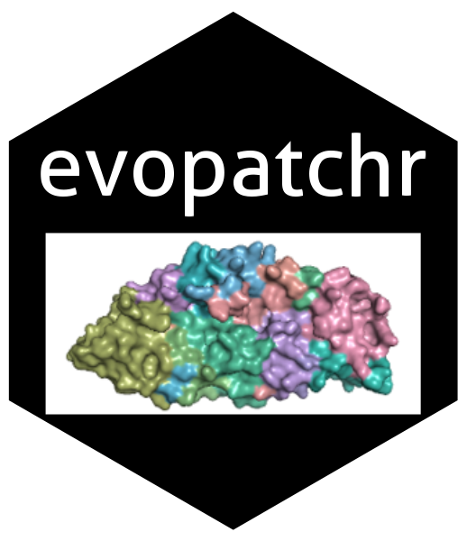

# evopatchr


**evopatchr** is an R package for structure-aware population genetics, enabling patch-level evolutionary analysis of protein surfaces. It integrates selection metrics with 3D structural data to identify spatially clustered signals of diversity and selection.

Designed with applications in immunology, virology, and comparative genomics, `evopatchr` supports multi-chain proteins, multi-model structures, and antibody–antigen complexes.

---

## Key Features

- Computes selection metrics (π, haplotype diversity, Tajima’s D) at surface-defined patches
- Detects and integrates antibody epitopes from PDB structures
- Supports multi-chain and multi-model PDBs for robust structural inference
- Maps structure-defined residues to codon-aligned MSA windows
- Generates B-factor-encoded PDBs and per-residue selection tables
- Fully self-contained: no reliance on DSSP, MAFFT, or external alignment tools

---

## Installation

To install from GitHub:

```r
# install.packages("devtools")
devtools::install_github("bbroyle/evopatchr")

# If you want to use the alignment features:
if (!requireNamespace("BiocManager", quietly = TRUE))
    install.packages("BiocManager")

BiocManager::install("msa")
```

## Quick Example

```r
library(evopatchr)

msa_path <- system.file("extdata", "rh5_pfalc.fasta", package = "evopatchr")
pdb_path <- system.file("extdata", "rh5_4wat.pdb", package = "evopatchr")

# run_patchr is designed for single msa and single pdb runs #
result <- run_patchr_single(msa_path = msa_path,
                             pdb_path = pdb_path,
                             chain = 'A')

write_stat_to_bfactor(result$selection_df,
                      result$pdb_info$pdb,
                      stat_name = "tajima",
                      outfile = "example_tajima.pdb")
```

## Running step-wise (more control)

```r
library(evopatchr)

# single MSA and PDB (or mmCIF) // essentially run_patchr_single() ----

# read in msa #
msa_info = WRAPPER_msa_to_ref(msa_path = 'example_multi_chain/e2_adj.aln')

# read in pdb #
pdb_info = WRAPPER_pdb_to_patch(pdb_path = 'example_multi_chain/e1e2_8fsj.pdb',
                                chain = c('E'))
  
# generate alignment between msa and pdb / and create msa_subsets #
map_info = WRAPPER_align_msa_pdb(msa_info = msa_info,
                                 pdb_info = pdb_info, 
                                 chain = 'E', coverage_plot = T)
  
# calculate selection #
selection_df = run_pegas_three(map_info$msa_subsets, pdb_info$residue_df)

```

## License

This package is released under the MIT License.  
Portions of the structural accessibility logic are adapted from the [DSSP project](https://github.com/PDB-REDO/dssp),  
licensed under the BSD 2-Clause License. See `inst/LICENSE.note` for details.

## Conatct

Brad Broyles
PhD Candidate, Computational and Structural Biology,
Purdue University
bbroyle@purdue.edu
